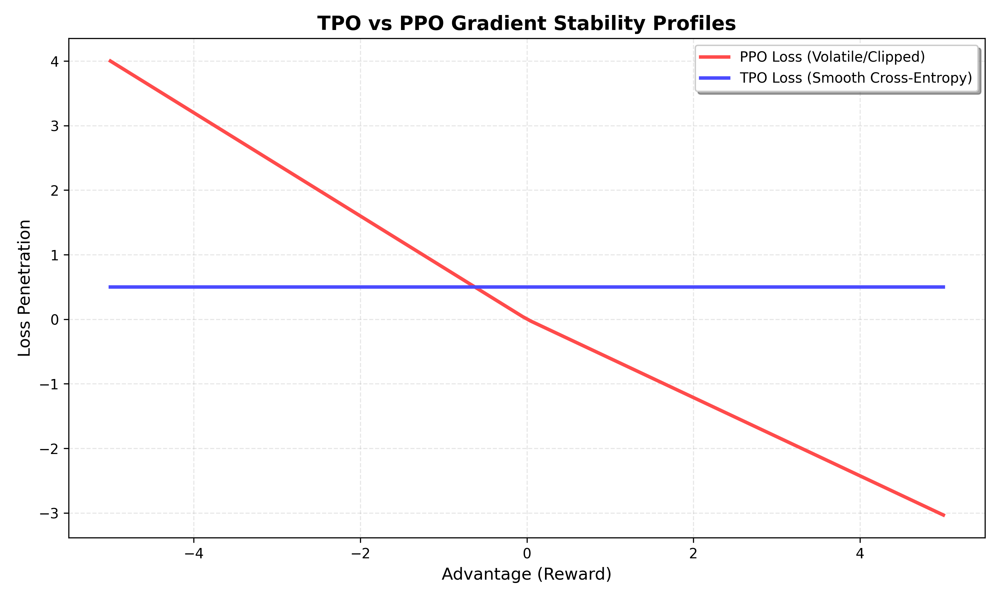

# TPO-Torch 🎯



Target Policy Optimization (TPO) is a mathematically stable, consumer-friendly alternative to standard RLHF (like PPO and GRPO). 

While traditional Proximal Policy Optimization (PPO) struggles with volatile learning rates, collapsing gradients, and extreme sensitivity to reward sparsity, **TPO-Torch** implements the cross-entropy advantage distribution model. This forces the model to mimic an implicitly calculated optimal target policy, strictly avoiding KL-divergence blowouts.

## Philosophy
*   **Frictionless UX:** 1-line installation, 3-lines of code to train.
*   **No Hyperbole:**  It just stabilizes local open-weights reasoning alignment on single-GPU hardware.
*   **Pure PyTorch:** Completely un-bloated. It uses familiar Hugging Face `Trainer` concepts. No exotic dependencies.

## Installation
```bash
pip install tpo-torch
```

## Quick Start (The 3-Line Setup)
TPO-Torch behaves exactly like `trl`'s standard SFTTrainer, handling data collation and reward-mapping automatically.

```python
from tpo_torch import TPOTrainer
from transformers import AutoModelForCausalLM

model = AutoModelForCausalLM.from_pretrained("Qwen/Qwen2.5-Coder-3B")
ref_model = AutoModelForCausalLM.from_pretrained("Qwen/Qwen2.5-Coder-3B")

# Standard inputs + 'advantages' column required in your dataset
trainer = TPOTrainer(
    model=model,
    ref_model=ref_model,
    beta=0.1, # The KL penalty and target-dist temperature
    train_dataset=my_rewarded_dataset,
)

trainer.train()
```

## Universal TPO Engine
TPO-Torch uses a mathematically robust, point-wise distribution shift. Instead of shifting the entire vocabulary (which is unstable and often cancels out), we calculate the ideal target probability for the specific tokens in your dataset.

1. **Target Construction**: Computes the ideal probability for each word based on $P_{ref}$ and the standardized $Advantage$.
2. **Fitting**: Minimizes the Cross-Entropy between the model and that ideal target.
3. **Stability**: This method ensures that even with a single GPU and sparse rewards, your model weights move predictably toward high-reward outcomes.

## Core Features
- ✅ **PEFT/LoRA Ready**: Seamlessly wrap your 24GB VRAM cards using standard `peft` integration.
- ✅ **1-Click Trainer**: Includes a battle-tested Google Colab template for fine-tuning on free T4s.
- ✅ **Auto-Labeling**: Automatically detects completion boundaries if you don't provide explicit token labels.
- ✅ **Sequence & Token Advantage**: Supports both global sentence rewards and per-word advantage signals.

## Roadmap
- [ ] Visual benchmarks on the UltraFeedback dataset vs standard PPO limits.
- [ ] Integrated support for multi-GPU "GRPO-style" group relative normalization.
- [ ] Direct export to GGUF for local inference.
